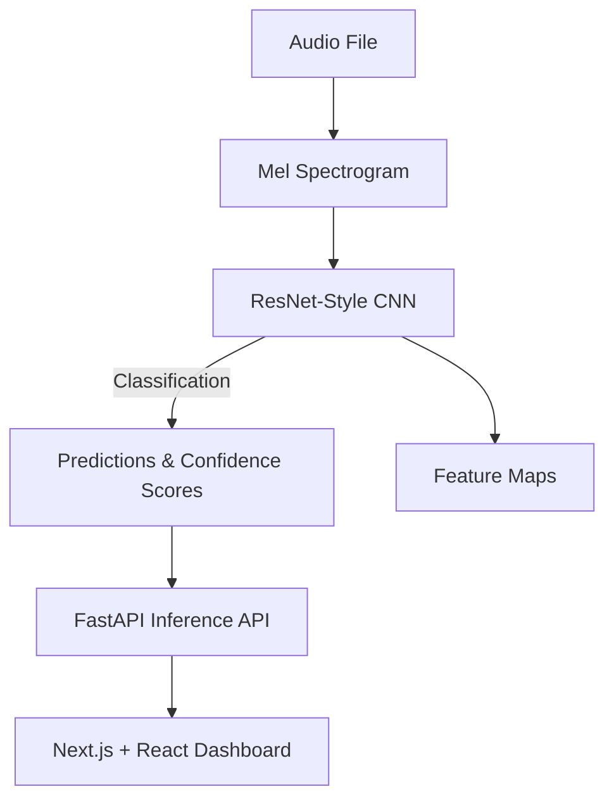

# <p align = "center"> EchoVision: AI powered audio Conventional Neural Network </p>

<p align="center">
</p>

<p align="center">
  <b>Train and deploy an AI-powered audio classification CNN from scratch.</b><br/>
  <i>Built with PyTorch, FastAPI, Next.js, React, and Tailwind CSS.</i>
</p>

<p align="center">
  <a href="https://github.com/your-username/echovision/stargazers"></a>
  <a href="https://github.com/your-username/echovision/network/members"></a>
  <a href="https://github.com/your-username/echovision/issues"></a>
  <a href="https://github.com/your-username/echovision/blob/main/LICENSE"></a>
</p>

---

## Overview

**EchoVision** is a complete end-to-end project for training and deploying a **ResNet-style audio classification CNN**. It classifies environmental sounds (like **dog barks** and **bird chirps**) from raw audio files, leveraging Mel Spectrograms and advanced data augmentation. The project includes a **Next.js + React dashboard** to upload audio, visualize predictions, and see CNN feature maps.

---

## Features

- 🧠 **Deep Audio CNN** for sound classification
- 🧱 **Residual ResNet architecture**
- 🎼 **Mel Spectrogram** conversion for audio
- 🎛️ **Data augmentation**: Mixup & Time/Frequency Masking
- ⚡ **Serverless GPU inference** with Modal
- 📊 **Interactive Next.js & React dashboard**
- 👁️ **Visualization of CNN feature maps**
- 📈 **Real-time classification with confidence scores**
- 🌊 **Waveform & spectrogram visualization**
- 🚀 **FastAPI inference API**
- ⚙️ **Optimized training** with AdamW & OneCycleLR
- 📈 **TensorBoard** for training analysis
- 🛡️ **Batch Normalization** for stability
- 🎨 **Tailwind CSS + Shadcn UI** for styling
- ✅ **Pydantic validation** for robust API requests

---

## Tech Stack

<p align="center">
  
</p>

- **Python + PyTorch** – Model training and inference
- **FastAPI** – Inference backend
- **Next.js 15 + React 19** – Frontend dashboard
- **Tailwind v4 + Shadcn UI** – Modern UI styling
- **Modal** – Serverless GPU inference
- **TensorBoard** – Training visualization

---

## Architecture



---

## Getting Started

### Prerequisites
- **Python** ≥ 3.9
- **Node.js** ≥ 20
- **GPU-enabled environment** (recommended for training)

### 1. Clone the Repository
```bash
git clone https://github.com/your-username/echovision.git
cd echovision
```

### 2. Set up Python Environment
```bash
python -m venv venv
source venv/bin/activate   # on Windows: venv\\Scripts\\activate
pip install -r requirements.txt
```

### 3. Train the Model
```bash
python train.py --data ./data --epochs 50
```
Monitor training with TensorBoard:
```bash
tensorboard --logdir runs
```

### 4. Run Inference API
```bash
uvicorn app.main:app --reload
```

### 5. Launch Dashboard
```bash
cd dashboard
npm install
npm run dev
```
Open [http://localhost:3000](http://localhost:3000).

---

## Project Structure
```
echovision/
├── app/                # FastAPI backend
├── models/             # Trained models
├── dashboard/          # Next.js + React frontend
├── data/               # Dataset
├── train.py            # Training script
└── requirements.txt    # Dependencies
```

---

## License
MIT © 2025 [Your Name](https://github.com/your-username)

---

<p align="center"><i>EchoVision — See what your AI hears.</i></p>
